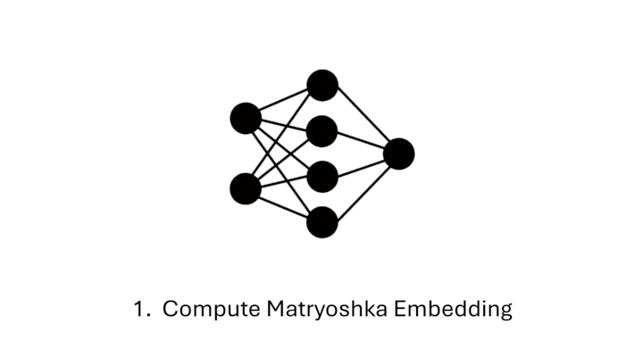
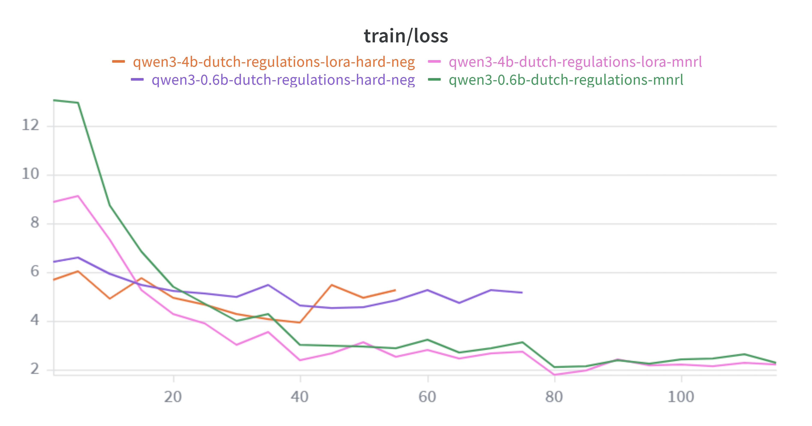

# How I Beat OpenAI's Best Embedding Model by 10 Points: Fine-Tuning for Dutch Legal Retrieval

*A practical deep-dive into fine-tuning embedding models for domain-specific RAG, from structural chunking to Matryoshka loss, hard negative mining, and lessons learned on bleeding-edge GPU hardware.*

---

## Introduction

Retrieval-augmented generation (RAG) over Dutch legal documents requires an embedding model that can match a user's question to the exact article or paragraph that answers it, out of hundreds of chunks.

Off-the-shelf embedding models like OpenAI's `text-embedding-3-large` are impressively general. They handle 100+ languages, score near the top of MTEB benchmarks, and work out of the box. But "general" isn't "specialised". When your corpus is a 144-page Dutch regulation full of cross-references, numbered paragraphs, and domain-specific terminology, a general model leaves a lot of retrieval quality on the table.

This post documents my experiments fine-tuning open-source embedding models on the **EU AI Act (Dutch translation)**, a single legal document, and how a few hours of GPU time turned generic models into domain specialists that outperform proprietary SOTA by a wide margin.

**The headline result:** my best fine-tuned model (Qwen3-Embedding-4B with LoRA) achieved **NDCG@10 = 0.9658**, compared to OpenAI's `text-embedding-3-large` at **0.8635**, a gap of over 10 points on the same evaluation set. Even my smallest model (560M parameters) beat OpenAI by 8.6 points after fine-tuning.

---

## The Document

The EU AI Act (`eu_ai_act_NL.pdf`) is a 144-page Dutch legal regulation with three distinct zones:

| Section | Share | Content |
|---|---|---|
| Recitals (Overwegingen) | ~42% | 180 numbered recitals providing legislative intent |
| Articles (Artikelen) | ~49% | 113 articles across 13 chapters, the binding provisions |
| Annexes (Bijlagen) | ~8% | 13 annexes with reference lists and technical requirements |

It's a challenging retrieval target: dense legal language, extensive cross-referencing between articles, and a hierarchy of chapters, articles, paragraphs (*leden*), and sub-items that carry semantic meaning.

---

## Step 1: Structural Chunking

The first decision was how to split the document into retrievable chunks. The naive approach (fixed-size splitting at 512 tokens) would cut articles mid-sentence and lose legal context. But legal documents have an inherently well-defined hierarchy. Articles, paragraphs, and sub-items are atomic semantic units designed by legislators. A structural chunker respects these boundaries.

My approach:
1. **Clean extraction**: strip headers/footers, fix column-break word splits
2. **Parse by structure**: recitals by number, articles by paragraph, definitions individually, annexes by item
3. **Size guardrails**: target 50–1,000 tokens. Oversized chunks split at sentence boundaries with overlap; tiny chunks merged with neighbours
4. **Rich metadata**: each chunk carries `section_type`, `chapter`, `article_number`, `paragraph_number`, `hierarchy_path`

**Result:** 573 chunks (223 recitals, 329 articles, 21 annexes). Token range 50–1,015, average 283.

I also produced a context-enriched variant where each chunk gets a hierarchy prefix (e.g. *"EU AI Act (NL) > Hoofdstuk III > Artikel 9 > Lid 2:"*), but trained on the raw version so the model doesn't become dependent on seeing the prefix at inference time.

---

## Step 2: Synthetic Training Data

I needed `(query, relevant_chunk)` pairs to train the embedding model. Real user queries don't exist yet, so I generated them with an LLM.

For each chunk, I generated 6 diverse Dutch queries across types: factual, definitional, procedural, scenario-based, and keyword search terms. Diversity ensures the model learns to match varied phrasings, not just keyword overlap.

The result: **2,284 query-chunk pairs** from 571 unique chunks. I split by chunk ID (not by pair) to prevent data leakage: all queries for a given chunk stay in the same split.

| Split | Pairs | Chunks |
|---|---|---|
| Train | 1,944 | 486 (85%) |
| Eval | 340 | 85 (15%) |

---

## Baselines: How Good Is Zero-Shot?

Before fine-tuning anything, I measured how well existing models handle the task out of the box. This establishes the bar that fine-tuning needs to clear.

| Model | NDCG@10 (dim=1024) | Notes |
|---|---|---|
| multilingual-e5-large | 0.8612 | Open-source encoder, 560M params |
| Qwen3-Embedding-0.6B | 0.8013 | Open-source decoder, 620M params |
| Qwen3-Embedding-4B | ~0.88 | Open-source decoder, 4B params |
| Qwen3-Embedding-8B | 0.8836 | Open-source decoder, 8B params |
| OpenAI text-embedding-3-large | 0.8635 | Proprietary, via Azure API |

The proprietary model and the open-source e5-large start at virtually the same level on this task (0.8635 vs 0.8612). OpenAI has no inherent advantage on Dutch legal text; its strength is breadth across languages and domains, not depth on any specific one. The Qwen3 family scales predictably: 0.6B → 4B → 8B yields steady gains, but none break 0.90 without fine-tuning.

---

## Evaluation Methodology

All experiments use the same evaluation protocol to ensure fair comparison.

**Metric: NDCG@10** (Normalized Discounted Cumulative Gain at rank 10), the primary metric throughout this post. It measures how well the model ranks the correct passage within the top 10 results for each query, with higher-ranked correct results scoring more.

$$\text{DCG@}k = \sum_{i=1}^{k} \frac{rel_i}{\log_2(i + 1)}$$

$$\text{NDCG@}k = \frac{\text{DCG@}k}{\text{IDCG@}k}$$

Where $rel_i$ is the relevance score of the result at rank $i$ (1 if the passage is relevant, 0 otherwise), and $\text{IDCG@}k$ is the DCG of the ideal ranking (all relevant documents ranked first). A score of 1.0 means the correct passage is always ranked #1; 0.5 means correct passages are scattered around the results.

**Eval set:** 340 queries mapped to 85 unique corpus chunks (15% of the data, split by chunk ID to prevent leakage). For each query, the model must rank the correct chunk above all 84 other chunks by cosine similarity.

**Protocol:** I used Sentence Transformers' `InformationRetrievalEvaluator`, which:
1. Encodes all 340 queries (with the appropriate prompt prefix)
2. Encodes all 85 corpus chunks
3. Truncates both to the target dimensionality (for Matryoshka evaluation)
4. Ranks all chunks by cosine similarity for each query
5. Computes NDCG@10, MRR@10, Recall@10, and Accuracy@k

This evaluator runs after each training epoch, and the best checkpoint (by NDCG@10 at dim=1024) is kept.

**Later cross-domain evaluation** uses a much harder benchmark: 912 chunks across two documents (EU AI Act + Dutch GDPR), with 5,472 queries. This is discussed in the results section.

---

## Step 3: The Training Pipeline

I used a two-stage approach that's become standard in embedding fine-tuning:

### Stage 1: In-Batch Negatives (MNRL)

**Multiple Negatives Ranking Loss (MNRL)** treats every other passage in the batch as a negative example. With batch size 64, each query gets 63 negatives "for free". The model learns: "given this query, the correct passage should be more similar than all 63 other passages in this batch."

> 
> *Conceptual diagram: how MNRL constructs the N×N similarity matrix from a single batch. Each query is compared against every passage in the batch; the diagonal contains positive pairs, everything else is a negative. Source: sentence-transformers documentation or similar.*

I wrapped MNRL in **MatryoshkaLoss**, which trains the model to produce useful embeddings at multiple truncated dimensionalities (1024, 768, 512, 256, 128, 64) simultaneously. This means you can use 1024-dim for maximum accuracy or 128-dim for 8× faster search, no retraining needed.

*Matryoshka embeddings: like Russian nesting dolls, each prefix of the full embedding vector is trained to be independently useful. Truncating from 1024 to 256 dims preserves the core information. Source: [Hugging Face blog on Matryoshka Embeddings](https://huggingface.co/blog/matryoshka).*

### Stage 2: Hard Negative Mining

After Stage 1, the model is good at distinguishing clearly different topics but may struggle with **confusing near-misses: passages that are topically similar but answer a different question.**

I used the Stage 1 model to mine hard negatives:
1. Encode all queries and corpus chunks with the Stage 1 model
2. For each query, rank all chunks by cosine similarity
3. Exclude the correct positive chunk
4. Take the most similar wrong chunks as hard negatives

The key insight: mining from the *adapted* model (not the base) produces more informative negatives. A passage that fools the already-fine-tuned model is a genuinely confusing case.

> 
> *Conceptual diagram: embedding space showing a query, its positive passage (close), easy negatives (far away), and hard negatives (close but wrong). Hard negatives force the model to learn fine-grained distinctions. Source: SBERT or ANCE paper illustrations.*

Stage 2 then continues training from the Stage 1 checkpoint with these hard negatives added to the dataset. A lower learning rate (typically half of Stage 1) prevents catastrophic forgetting.

*W&B training loss for the four Qwen3 runs. Stage 1 lines (mnrl) are longer than Stage 2 lines (hard-neg) because Stage 1 trains for 3 epochs vs 2. The 0.6B model starts with higher loss (~13) than the 4B (~9), reflecting the stronger pretrained representations of the larger model. All runs converge to ~2.*

---

## The Models

I fine-tuned four model families, each teaching me something different:

### multilingual-e5-large (560M, encoder)

My starting point. A well-established multilingual retrieval model with 1024-dim embeddings and a maximum of 512 tokens. Uses `"query: "` and `"passage: "` prefixes.

### Qwen3-Embedding-0.6B (620M, decoder)

A decoder-based embedding model from Alibaba, built on Qwen3. Uses last-token pooling with left padding, instruct-style query prompts, and supports up to 8,192 tokens. Despite being decoder-based (which seems counterintuitive for embeddings), it performs comparably to encoder models thanks to massive pre-training and strong instruction-following ability.

### Qwen3-Embedding-4B (4B, decoder, LoRA)

The 4B variant, too large for full fine-tuning on my 32GB GPU. I used **LoRA (Low-Rank Adaptation)**, which freezes the base weights and trains only small adapter matrices. With rank 16 targeting attention projections, I trained just 11.8M parameters (0.29% of the total), yet this was enough to outperform every other model.

> 
> *Conceptual diagram: LoRA inserts two small matrices A and B alongside the frozen weight matrix W. The update is W + A×B, where A and B have low rank r (e.g. 16). Only A and B are trained; the original weights are untouched. Source: original LoRA paper (Hu et al., 2021).*

### Qwen3-Embedding-8B (8B, decoder, LoRA)

The largest model in the Qwen3-Embedding family: 7.6B parameters, 4096-dim embeddings, #1 on the MTEB multilingual leaderboard. At ~16GB in bf16 for base weights alone, it pushed my 32GB RTX 5090 to its absolute limit: `mini_batch_size=1` for both stages, `eval_batch_size=1`, and mandatory LoRA merging before any evaluation (the PEFT wrapper overhead alone causes OOM on 8B). With rank 16, this yields 15.3M trainable parameters (0.20%).

---

## Results: The EU AI Act Benchmark

### The Headline Numbers

All results on the held-out eval set: 340 queries, 85 corpus chunks, NDCG@10 at dim=1024.

| Model | Zero-shot | Stage 1 | Stage 2 | Total Δ |
|---|---|---|---|---|
| multilingual-e5-large (Colab, batch 64) | 0.8612 | 0.9436 | **0.9465** | +0.0853 |
| multilingual-e5-large (RTX, batch 8) | 0.8612 | 0.9327 | **0.9492** | +0.0880 |
| Qwen3-Embedding-0.6B | 0.8013 | 0.9419 | **0.9467** | +0.1454 |
| Qwen3-Embedding-4B (LoRA) | — | 0.9631 | **0.9658** | — |
| Qwen3-Embedding-8B (LoRA) | 0.8836 | **0.9625** | 0.9625 | +0.0789 |
| OpenAI text-embedding-3-large | **0.8635** | — | — | — |

The e5-large appears twice because the batch-8 RTX pipeline (fewer in-batch negatives, more hard negative gain) and the batch-64 Colab pipeline produced different Stage 1/Stage 2 splits, but converged to similar totals, as discussed below.

Fine-tuning adds 8–15 points of NDCG@10 across every model tested. The 4B LoRA model, training just 0.29% of its parameters on 1,944 synthetic pairs, beats OpenAI's best embedding API by over 10 points. The 8B model matches the 4B at dim=1024 but offers marginal gains at lower dimensions. The 4B is the sweet spot given the 2× VRAM cost of 8B.

### Matryoshka: Quality at Every Size

One of the most practically useful results. MatryoshkaLoss flattened the quality-vs-size curve dramatically:

| Dim | Before fine-tuning | After fine-tuning | Retention |
|---|---|---|---|
| 1024 | 0.8612 | 0.9465 | 100% |
| 512 | 0.8495 | 0.9412 | 99.4% |
| 256 | 0.7848 | 0.9423 | 99.6% |
| 128 | 0.7283 | 0.9277 | 98.0% |
| 64 | 0.6009 | 0.9058 | 95.7% |

Before fine-tuning, dim=64 retained only 70% of dim=1024's quality. After: **95.7%**. This means you can use 64-dimensional embeddings (16× less storage, 16× faster search) with barely any quality loss. For production RAG, this is transformative.

### vs. Proprietary SOTA

OpenAI's `text-embedding-3-large` also supports Matryoshka dimensions. Here's the comparison at multiple sizes:

| Dim | OpenAI | Qwen3-4B LoRA | Δ |
|---|---|---|---|
| 1024 | 0.8635 | **0.9658** | **+0.1023** |
| 512 | 0.8573 | **0.9526** | +0.0953 |
| 256 | 0.8166 | **0.9420** | +0.1254 |
| 128 | 0.7598 | **0.9188** | +0.1590 |

The gap *widens* at lower dimensions. OpenAI's Matryoshka degradation is much steeper (12% relative decline from full to 128-dim vs. only 4.5% for my fine-tuned model). Domain-specific fine-tuning with MatryoshkaLoss teaches the model to be useful at every dimensionality.

---

## The Surprising Findings

### 1. Hard negatives are a great equaliser

I ran the same pipeline with different batch sizes (which controls in-batch negatives):

| Config | In-batch neg | Stage 1 | Stage 2 | Pipeline total |
|---|---|---|---|---|
| Batch 8 | 7 | 0.9327 | **0.9492** | +0.0165 from S2 |
| Batch 64 | 63 | 0.9436 | **0.9465** | +0.0029 from S2 |
| Batch 128 | 127 | 0.9422 | **0.9463** | +0.0041 from S2 |

The weaker Stage 1 is (fewer in-batch negatives), the more Stage 2 gains from hard negatives. The pipeline totals converge to nearly the same quality regardless of Stage 1 batch size. Hard negatives fill in exactly what in-batch negatives missed.

**Practical implication:** Don't obsess over achieving maximum batch size in Stage 1. If you're VRAM-constrained, a smaller batch with hard negatives in Stage 2 gets you to the same place.

### 2. More hard negatives can hurt

| Hard negatives per query | Stage 2 NDCG@10 |
|---|---|
| 1 (unfiltered) | **0.9463** |
| 5 (unfiltered) | 0.9398 (regression!) |

Mining 5 raw hard negatives per query caused a **regression**. The top-5 includes progressively less informative negatives that add noise, and with 1 positive vs. 5 hard + 127 in-batch negatives, the positive signal gets drowned out.

The fix: **filtering** with three parameters:

| Parameter | Value | Purpose |
|---|---|---|
| `range_min` | 5 | Skip the top-5 most similar candidates, as they're likely false negatives or near-duplicates |
| `margin` | 0.1 | Negative similarity must be at least 0.1 lower than the query-positive similarity |
| `max_score` | 0.9 | Skip any candidate with cosine similarity > 0.9, likely a true positive |

This produces "Goldilocks" negatives: hard enough to be informative, but not so hard they're actually correct answers the model shouldn't learn to reject. For datasets under ~10K pairs, **1 filtered hard negative per query** is the sweet spot.

### 3. LoRA on 0.29% of parameters beats full fine-tuning

The 4B model, training just 11.8M out of 4,034M parameters, outperformed the fully fine-tuned 560M e5-large and 620M Qwen3-0.6B models at every dimension. LoRA's constraint to a low-rank subspace acts as an implicit regulariser, preventing overfitting on my small (1,944 pair) dataset while still allowing enough capacity for domain adaptation.

---

## Cross-Domain Evaluation: Does It Generalise?

The results above were all measured on an 85-chunk EU AI Act eval set (the held-out 15% of chunks). This made for a favourable retrieval environment: the correct chunk only needed to be distinguished from 84 others. Two questions remained:

1. **Is 85 chunks realistic?** A production RAG pipeline has hundreds or thousands of chunks. With a small corpus, even zero-shot models score artificially high.
2. **Is this generalisation or memorisation?** The models were trained on EU AI Act text. Do they learn transferable Dutch legal retrieval, or just EU AI Act-specific patterns?

To answer both, I chunked and generated synthetic queries for the **Dutch GDPR (AVG)**, a completely separate legal document that no model saw during training. This gave me 377 GDPR chunks and 2,262 queries to use as a clean, held-out generalization test.

### GDPR results (completely unseen document)

NDCG@10 at dim=1024, all models evaluated on the 377-chunk GDPR corpus:

| Model | GDPR NDCG@10 | Δ vs zero-shot |
|---|---|---|
| multilingual-e5-large (zero-shot) | 0.6475 | — |
| Qwen3-0.6B (zero-shot) | 0.6007 | — |
| Qwen3-4B (zero-shot) | 0.7179 | — |
| Qwen3-8B (zero-shot) | 0.7348 | — |
| OpenAI text-embedding-3-large | 0.6733 | — |
| multilingual-e5-large (EU AI Act FT) | 0.7311 | +0.0836 |
| Qwen3-0.6B (EU AI Act FT) | 0.7110 | +0.1103 |
| **Qwen3-4B (EU AI Act FT)** | **0.7900** | **+0.0721** |
| **Qwen3-8B (EU AI Act FT)** | **0.8053** | **+0.0705** |

Every fine-tuned model improved on a document it never saw. The models were trained exclusively on EU AI Act data, yet they gained +7–11 points of NDCG@10 on GDPR. This is not memorisation: they learn transferable Dutch legal retrieval patterns (vocabulary, regulatory sentence structure, query-passage matching conventions).

### What this reveals

**Fine-tuning transfers across legal domains.** The GDPR gains are consistent across all four model scales. Even the smallest model (e5-large, 560M) picks up +8.4 points on an unseen document after fine-tuning on a different one. One caveat: GDPR is inherently easier than the EU AI Act (all models score +6–9 pts higher on GDPR zero-shot, likely due to shorter, more prescriptive articles). The transfer finding still holds, but the absolute GDPR scores are partly inflated by corpus difficulty.

**Open-source zero-shot beats proprietary.** This was invisible on the old 85-chunk benchmark, where OpenAI (0.8635) edged out e5-large (0.8612). On the harder GDPR benchmark, Qwen3-4B zero-shot outperforms OpenAI by +4.5 pts (0.7179 vs 0.6733), without any fine-tuning at all.

**Small eval corpora lie.** On the original 85-chunk EU AI Act eval, Qwen3-4B LoRA scored 0.9658. On the 377-chunk GDPR (a harder, unseen retrieval space), the same model scores 0.7900. Always evaluate on a corpus at least as large as your production index.

---

## Hardware: Training on an RTX 5090

All training ran on a single NVIDIA RTX 5090 (32GB VRAM, Blackwell sm_120).

### CachedMNRL (GradCache): decoupling batch size from VRAM

MNRL uses in-batch negatives: each query treats every other passage in the micro-batch as a negative. With micro-batch 8 (the fp32 limit on e5-large), that's only 7 negatives per query. Industry recommends 64–128.

`CachedMultipleNegativesRankingLoss` (from sentence-transformers, based on the GradCache paper) solves this by decoupling the contrastive pool size from VRAM. It works in three steps:

1. **Embed** all N samples in small mini-batches *without gradients* (cheap forward passes)
2. **Compute** the full N×N similarity matrix and loss using the cached embeddings (tiny, just floats)
3. **Re-embed** in small mini-batches *with gradients*, chaining the cached loss signals into the backward pass

With `batch_size=128` and `mini_batch_size=4`, each query sees 127 negatives while only 4 samples occupy VRAM at any time. The trade-off is ~20% slower training (every sample is embedded twice).

In practice, this was less impactful than I expected. My batch-8 e5-large pipeline (only 7 in-batch negatives) produced the best overall e5-large result (0.9492 NDCG@10) because Stage 2 hard negatives compensated for the weak Stage 1 signal. With CachedMNRL's 127 negatives, Stage 1 was stronger (0.9422 vs 0.9327), but Stage 2 added less on top (+0.004 vs +0.017). The pipeline totals converged. Hard negatives are a great equalizer.

### Training the 8B model on 32GB

The Qwen3-8B model pushed the RTX 5090 to its absolute limit. Base weights alone consume ~16GB in bf16, leaving only ~16GB for activations, optimizer states, and PyTorch overhead. Even with LoRA (only 15.3M trainable params) and flash_attention_2 installed, `mini_batch_size` had to be 1 for both stages. Every attempt at mini_batch_size=2 OOM'd.

The trickiest issue: training completed successfully, but the script OOM'd during the final evaluation (before `save_pretrained`). During in-trainer eval, the training state (optimizer, cached embeddings) still occupies memory alongside the evaluation forward pass. The fix was setting `eval_batch_size=1`, but I only discovered this after losing the final save and having to recover from Trainer checkpoints.

Another 8B-specific gotcha: evaluating a model loaded as `base + PeftModel.from_pretrained()` also OOM'd. The PEFT wrapper adds overhead from duplicate weight references and adapter bookkeeping. The fix: always `merge_and_unload()` before evaluation, which merges the LoRA weights into the base and removes the wrapper entirely.

---

## What I'd Do Differently

1. **Sweep hyperparameters from the start.** I used a single LR/epochs config per model. A minimal sweep (3 learning rates × 3 epoch counts = 9 runs, ~3 hours) would have either confirmed I'm near-optimal or found a better configuration. The expected gain is small when you're already at 0.94+, but the confidence is worth the compute.

2. **Filter hard negatives from the beginning.** My initial 5-negative experiment regressed because I mined raw top-K without filtering out likely false negatives. Adding margin and range-based filtering should have been the default.

3. **Start with CachedMNRL.** The standard MNRL → GradCache migration taught me a lot, but if I were doing it again, I'd start with CachedMNRL and skip the batch-size constraints entirely.

4. **Evaluate on a larger corpus sooner.** My initial eval set had only 85 chunks, which inflated scores and masked real retrieval difficulty. The moment I expanded to 912 chunks, NDCG@10 dropped from 0.95+ to 0.76 for the same model. Larger eval corpora give more honest (and more useful) signal.

---

## The Recipe

For anyone looking to replicate this on their own domain:

1. **Chunk structurally.** Respect the document's natural boundaries: articles, sections, paragraphs. Don't split at arbitrary token counts.

2. **Generate synthetic queries with an LLM.** 5–6 diverse queries per chunk, covering different question types (factual, definitional, procedural, scenario, keyword). This takes minutes and costs pennies.

3. **Split by chunk, not by pair.** Prevent data leakage by ensuring all queries for a given chunk stay in the same train/eval split.

4. **Stage 1: CachedMNRL + MatryoshkaLoss.** Batch size 128, mini-batch 4, 3 epochs, LR 2e-5. This gives you strong in-batch contrastive learning with multi-dim embeddings.

5. **Stage 2: Mine hard negatives from Stage 1, then fine-tune.** 1 filtered hard negative per query is the sweet spot for small datasets. Lower LR (1e-5), 2 epochs.

6. **For models > 1B params: use LoRA.** Rank 16, alpha 32, targeting attention projections. This gets you 98%+ of full fine-tuning quality at a fraction of the VRAM.

7. **Evaluate on a realistic corpus.** At least hundreds of chunks, preferably from multiple documents. Small eval sets lie.

Total wall-clock time for the full pipeline (chunking → synthetic data → Stage 1 → mining → Stage 2 → evaluation): **under 2 hours** on a single GPU for a 0.6B model, ~3 hours for 4B with LoRA.

---

## Next Steps

The results above were all trained on a single document (EU AI Act). The natural next step is **multi-document fine-tuning**, training on EU AI Act + GDPR + UAVG (Dutch implementation law) jointly. Early results with Qwen3-0.6B on this combined corpus show NDCG@10 = 0.9036 on a 145-chunk, 858-query eval set, with strong performance across three diverse legal documents from a single model.

Further improvements I'm exploring:

1. **Cross-document multi-hop queries**: generating synthetic queries that require information from multiple documents (e.g. "How does the UAVG implement the GDPR's requirements for data protection officers?"). These teach the model to retrieve across document boundaries, which is critical for production RAG over heterogeneous corpora.

2. **Quality scoring and filtering**: using an LLM judge to score each synthetic (query, chunk) pair on relevance, accuracy, clarity, and specificity, then filtering out low-quality pairs before training. With only ~2,000 pairs, even 5–10% noise matters.

3. **Lower contrastive temperature**: NVIDIA's embedding fine-tuning recipe uses temperature 0.02 (vs. the default 0.05). This sharpens the loss landscape and focuses the model on the hardest negatives. Worth testing now that hard negative filtering is in place.

4. **Hyperparameter sweeps**: confirming that the single LR/epoch configuration used throughout is actually near-optimal. A minimal sweep (3 LRs × 3 epoch counts = 9 runs, ~3 hours) would provide this confidence.

---

## Final Scoreboard

| Model | Params | NDCG@10 | vs. OpenAI |
|---|---|---|---|
| OpenAI text-embedding-3-large | Unknown | 0.8635 | — |
| multilingual-e5-large (zero-shot) | 560M | 0.8612 | -0.0023 |
| multilingual-e5-large (fine-tuned) | 560M | **0.9492** | +0.0857 |
| Qwen3-Embedding-0.6B (fine-tuned) | 620M | **0.9467** | +0.0832 |
| Qwen3-Embedding-8B LoRA (fine-tuned) | 8B | **0.9625** | +0.0990 |
| **Qwen3-Embedding-4B LoRA (fine-tuned)** | **4B** | **0.9658** | **+0.1023** |

A few hours of training on synthetic data, a single GPU, and €0.75 in electricity. The models are local, private, free at inference, and far better at the task than the best proprietary embedding API.

Domain-specific fine-tuning isn't optional for serious RAG. It's the single highest-leverage investment you can make.

---

*All code, training scripts, and model cards are available in the [repository](https://github.com/DanielNoumon/finetune_embeddings). Models are published on HuggingFace: [qwen3-embedding-0.6b-dutch-regulations](https://huggingface.co/danielnoumon/qwen3-embedding-0.6b-dutch-regulations), [qwen3-embedding-4b-dutch-regulations](https://huggingface.co/danielnoumon/qwen3-embedding-4b-dutch-regulations).*
